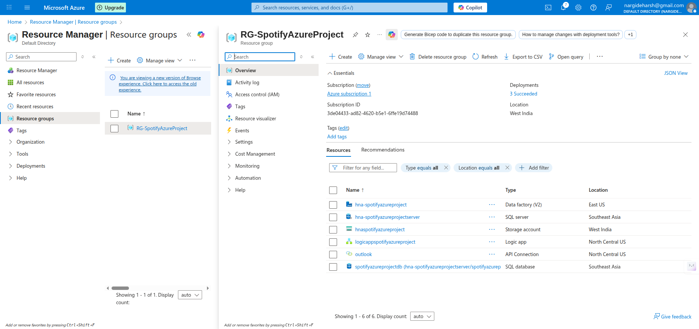
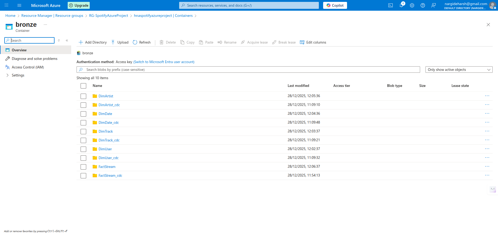
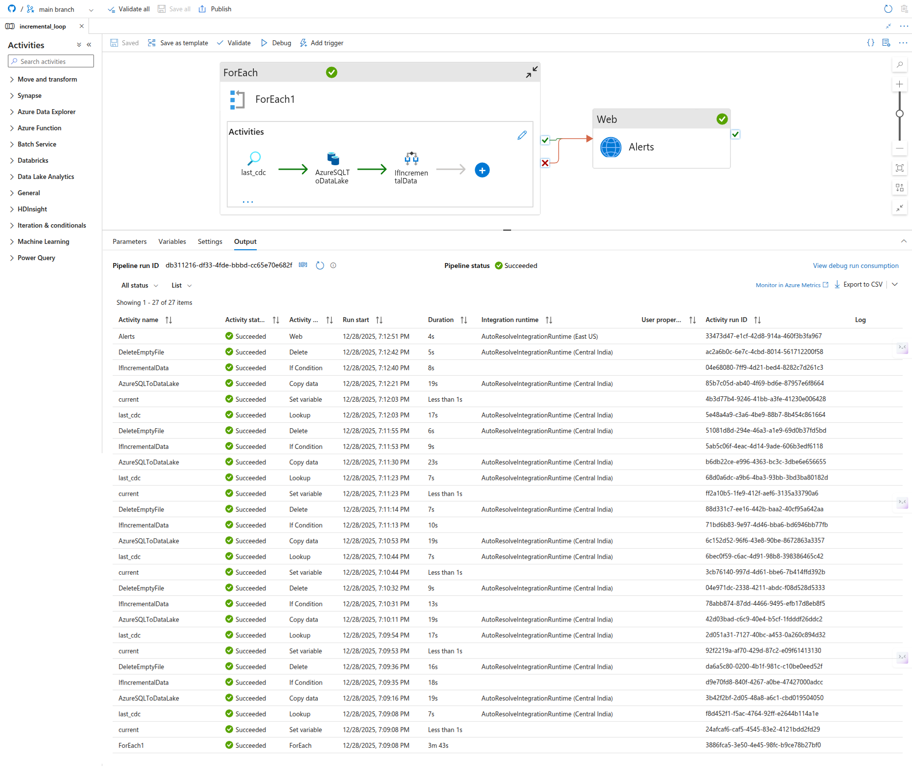
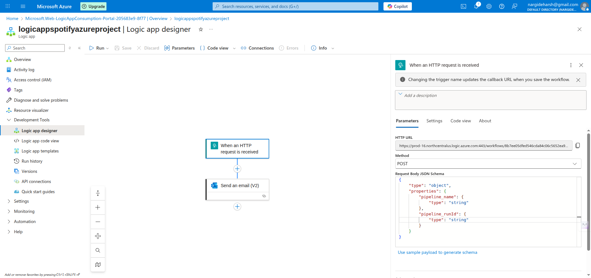
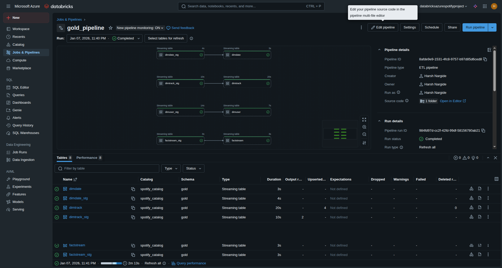

# Spotify End-to-End Azure Data Engineering Project

## Project Overview
This project is a comprehensive, end-to-end data engineering solution designed to build a competitive understanding of the **Azure data stack**. It implements a **Medallion Architecture** (Bronze, Silver, and Gold layers) to process Spotify-themed data from an Azure SQL Database source through to a curated Gold layer using industry-standard tools and practices.

## Architecture
The pipeline follows a structured data journey:
1.  **Source:** Data is hosted on an **Azure SQL Database**.
2.  **Ingestion (Bronze Layer):** **Azure Data Factory (ADF)** is used for data ingestion. The pipelines are built to be dynamic and parameterized, supporting **incremental loading** and **backfilling capabilities** using JSON-based watermarking.
3.  **Transformation (Silver Layer):** **Azure Databricks** processes the raw data using **Spark Structured Streaming** and **Autoloader**. This layer features **metadata-driven notebooks** powered by the **Jinja templating library** for reusable and scalable code.
4.  **Final Model (Gold Layer):** Data is modelled into a **Star Schema** using **Delta Live Tables (DLT)**. This includes implementing **Slowly Changing Dimensions (SCD) Type 2** to maintain historical data integrity.
5.  **Deployment:** The project utilizes **Databricks Asset Bundles (DABs)** for a modern CI/CD approach to deployment.

### Azure Resource Group

### Azure ADLS

### Azure Data Factory

### Logic App For Email Service

### Databricks Pipeline

## Tech Stack
*   **Cloud Provider:** Azure
*   **Orchestration:** Azure Data Factory (ADF)
*   **Data Warehouse/Database:** Azure SQL Database
*   **Data Lake:** Azure Data Lake Storage (ADLS) Gen2
*   **Processing Engine:** Azure Databricks (Spark)
*   **Governance:** Unity Catalog
*   **Programming:** Python, SQL, Jinja

## Key Features
*   **Incremental Data Loading:** Optimized pipelines that only process new data to save computation costs.
*   **Backfilling Logic:** Ability to re-run pipelines for specific historical intervals.
*   **Metadata-Driven Design:** Highly reusable code structure where pipeline behaviour is defined by metadata rather than hardcoding.
*   **SCD Type 2 Implementation:** Uses Lakeflow/DLT to track historical changes in dimensions automatically.
*   **Automated Alerts:** Integrated **Logic Apps** to send email notifications upon pipeline failure.

## Repository Structure
Based on the project files:
*   `Databricks/`: Contains notebooks for Silver and Gold transformations and DAB configurations.
*   `factory/`: ADF resource configurations.
*   `linkedService/`: Connection definitions for SQL and Data Lake.
*   `pipeline/`: JSON definitions of the ingestion pipelines.
*   `dataset/`: Definitions for source and sink data structures.
*   `source_scripts/`: SQL scripts for setting up the initial database environment.
